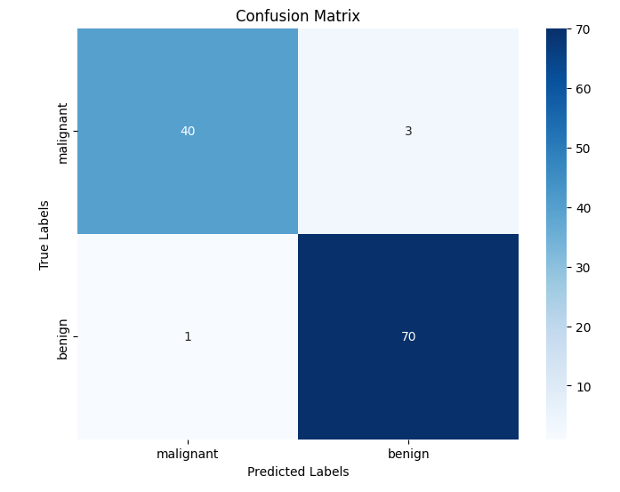

# ADS0019
Repository created to upload the "| ADS0019 | CLOUD DEVELOPMENT" project

<a href="https://github.com/joseantonioneto/ADS0019/blob/main/C%C3%B3pia_de_Classifica%C3%A7%C3%A3o_KNN_Cancer_de_Mama.ipynb"> Cópia de Classificação KNN Cancer de Mama</a>

<h1> Confusion Matrix</h1>

<h1> Data 2D</h1>

------------------------------------------

<a href = "https://github.com/joseantonioneto/ADS0019/blob/main/kNN_code_Fundamentos_de_Aprendizagem_de_M%C3%A1quina_pg_99_110_.ipynb"> kNN code Fundamentos de Aprendizagem de Máquina pg 99 - 110</a>

<h1> Dados em Matriz e Array </h1>

<h1> Varredura de Parâmetros</h1>

